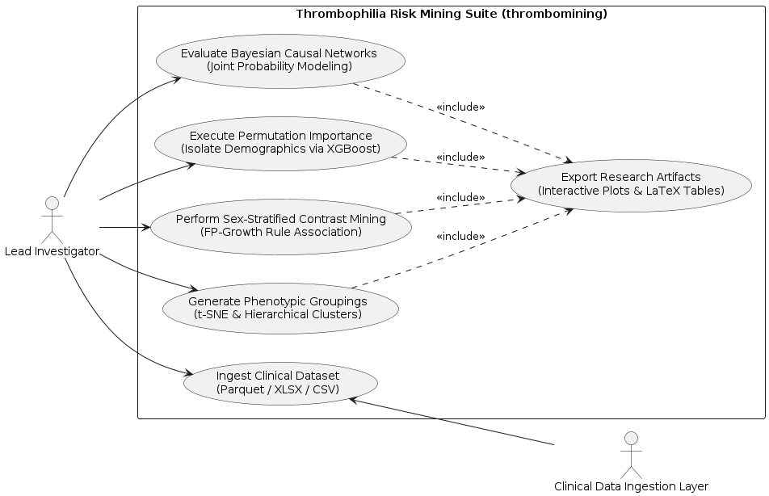
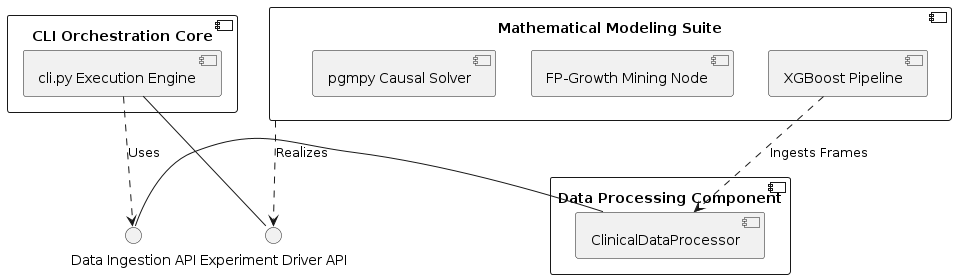

# Comprehensive Data Mining and Machine Learning Workflows for Thrombophilia Risk Stratification

This repository houses an advanced, object-oriented framework engineered to deconstruct hypercoagulable risk factors utilizing a consolidated national database for thrombophilic disease.

## Functional Architecture

The functional capabilities of the execution engine and its interaction with clinical research actors are described in the following specification:



The entire dataset operations, extending from compressed Parquet tables to multi-stage statistical outputs, follow a highly decoupled execution path:



## Detailed Technical Documentation

For a deep dive into the runtime sequence validation, class inheritance structures, state machine boundaries, and multi-node deployment topologies, please consult the comprehensive technical manual available at [Technical Reference Guide](docs/technical_reference.md).

## One-off Dataset Preparation

The repository also includes a one-off preparation utility for adapting
`data/patD.parquet` to an external Excel variable specification. The tool reads
the variables listed in column A, preserves `id_pacie` only as a reference
column, applies a minimal normalization layer required for analysis, and writes
both a filtered parquet and a JSON validation report.

```bash
python -m src.patd_spec_tool \
  --spec-xlsx "/tmp/varibeles explained.xlsx" \
  --output-parquet out/patD_spec_subset.parquet \
  --report-json out/patD_spec_subset_validation.json
```
