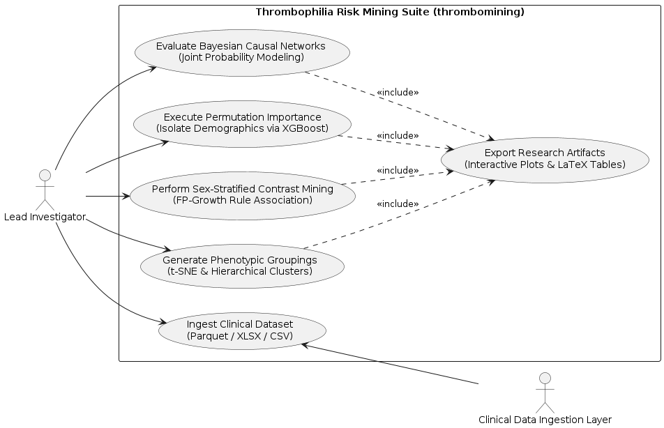
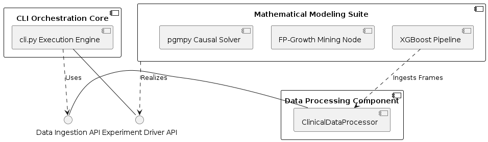

# Comprehensive Data Mining and Machine Learning Workflows for Thrombophilia Risk Stratification

This repository houses an advanced, object-oriented framework engineered to deconstruct hypercoagulable risk factors utilizing a consolidated national database for thrombophilic disease.

## Functional Architecture

The functional capabilities of the execution engine and its interaction with clinical research actors are described in the following specification:



The entire dataset operations, extending from compressed Parquet tables to multi-stage statistical outputs, follow a highly decoupled execution path:



## Detailed Technical Documentation

For a deep dive into the runtime sequence validation, class inheritance structures, state machine boundaries, and multi-node deployment topologies, please consult the comprehensive technical manual available at [Technical Reference Guide](docs/technical_reference.md).

## One-off Dataset Preparation

The repository also includes a one-off preparation utility for adapting
`data/patD.parquet` to an external Excel variable specification. The tool reads
the variables listed in column A, preserves `id_pacie` only as a reference
column, applies a minimal normalization layer required for analysis, and writes
both a filtered parquet and a JSON validation report.

```bash
python -m src.patd_spec_tool \
  --spec-xlsx "/tmp/varibeles explained.xlsx" \
  --output-parquet out/patD_spec_subset.parquet \
  --report-json out/patD_spec_subset_validation.json

python -m src.patd_spec_tool \
  --input-parquet data/patD.parquet \
  --spec-xlsx "/tmp/varibeles explained.xlsx" \
  --target-columns var161 \
  --filter-column var161 \
  --filter-allowed-values Sí No \
  --output-parquet data/patD_var161.parquet \
  --report-json out/patD_var161_validation.json
```

The command-line summary now reports the full row trace: input rows, rows
after applying the Excel criteria, rows after the optional value filter, and
final output rows written to the parquet. The JSON validation report mirrors
this with `source_row_count`, `output_row_count`, `criteria_audit`, and
`row_filter_audit`.

## Manuscript Review Support

The repository now includes a manuscript-oriented audit helper that rebuilds the
main methodological checks raised during peer review directly from the local
registry snapshot. During preprocessing, missing `ana_dura` values are
normalized to `No buscada`, so every downstream cohort split treats unlabeled
thrombophilia-study rows as not searched. The helper creates mutually exclusive
`tested` vs `not tested` cohort tables, outcome prevalence summaries restricted
to tested patients, selected-threshold confusion matrices, calibration
summaries, temporal validation outputs, and a ready-to-share Markdown response
in `out/`.

```bash
python src/manuscript_support.py \
  --data data/patD.parquet \
  --output-dir out
```

Key artifacts include `out/coauthor_response_review.md`,
`out/tested_vs_not_tested_baseline.csv`, `out/score_clinical_utility_summary.csv`,
and `out/temporal_validation_summary.csv`.
