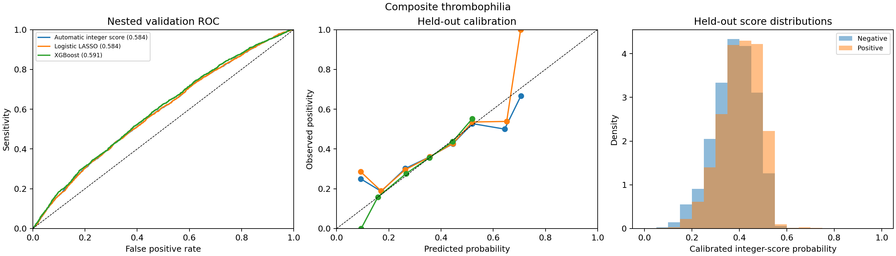
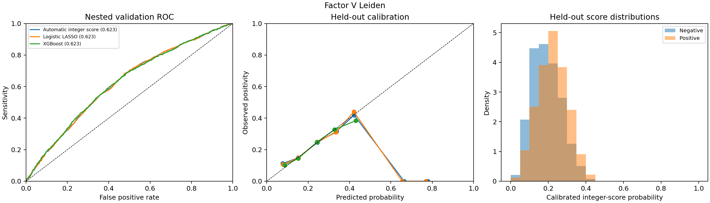
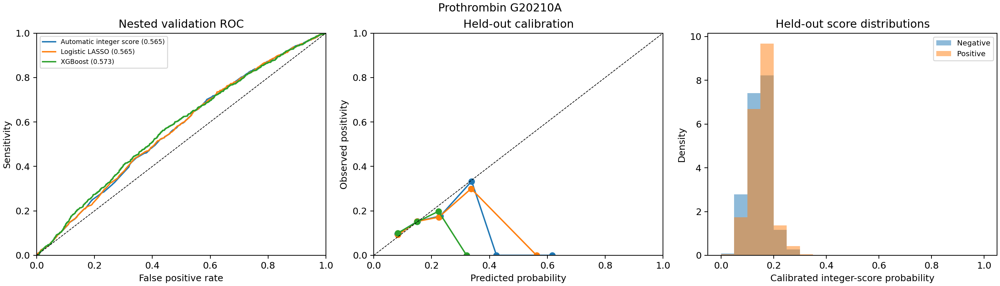
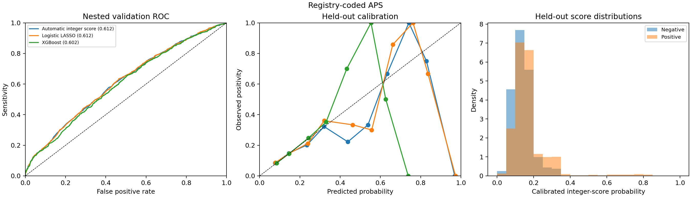
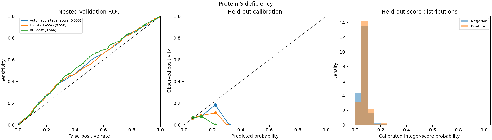
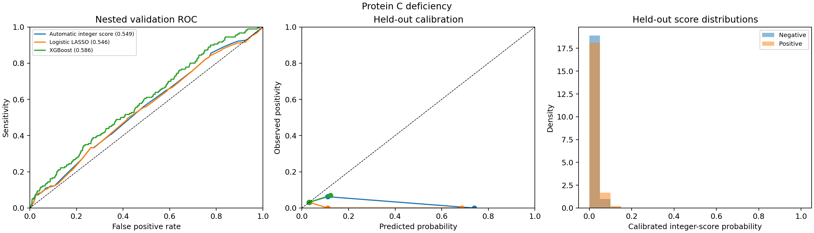
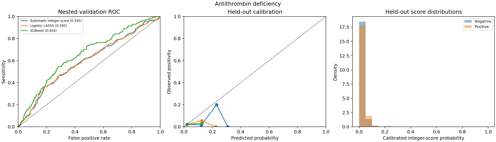
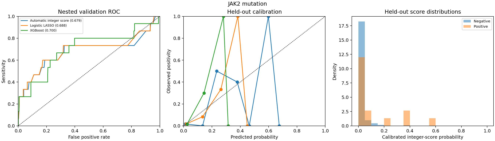
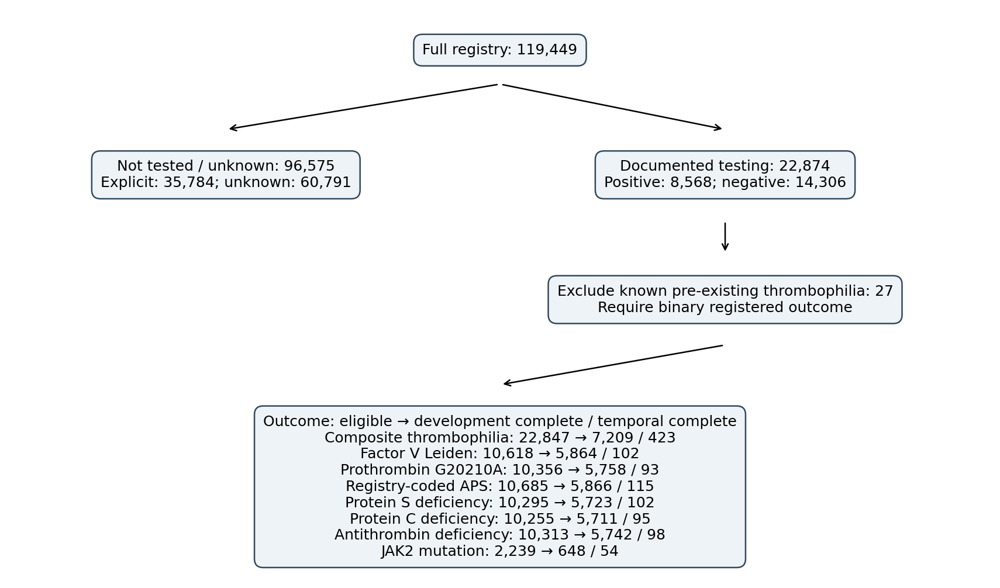

# Replacement manuscript sections — recalculated analysis

These sections and tables supersede the numerical statements in the supplied draft. They describe the executed analysis, not a reproduction of the old AUCs. JAK2 remains descriptive. All confidence intervals are conditional on the stored predictions.

## Methods

The full registry was used for descriptive comparisons. Documented thrombophilia testing was defined by a positive or negative global testing label. Explicitly untested records and records with unknown global testing status were combined for the descriptive not-tested/unknown group, with their component counts reported separately. Predictive analyses required documented global testing; subtype analyses additionally required a binary registered result for that subtype. Patients with explicitly documented prior carrier status or known APS were excluded from predictive analyses. Unknown prior-carrier status was not equated with confirmed absence. The extract contains no independent assay-performed flag; consequently, this operational definition cannot independently establish laboratory testing for every subtype-negative record.

Only an explicit allowlist of index-event demographic, presentation, history and laboratory variables was eligible. Thrombophilia results, global testing status, previously known APS, quantitative D-dimer, follow-up events and identifiers were excluded as predictors. Statin treatment (trat_est) and recent hormone exposure (fr_estro) were treated as distinct variables. Numeric quality failures were set to missing without deleting registry rows. Fixed clinical categories replaced sample-derived quantiles: age <50/50–69/≥70 years; hemoglobin <12/≥12 g/dL; platelets <144/144–400/>400 ×10^9/L; leukocytes <4/4–11/>11 ×10^9/L; and the additional categories in Supplementary Table S1. Categorical D-dimer used the recorded result; explicitly not performed and unknown remained distinct. Missing history was not assumed absent. Quantitative D-dimer was not used or converted to an assay-independent threshold.

Development used diagnoses through 2021; diagnoses from 2022 onward were held out. For each outcome, nonconstant candidate variables with no more than 40% missingness in development were retained for the principal comparison. This outcome-blind candidate-availability definition was fixed using the development covariate distribution before internal cross-validation. Complete cases for that candidate set formed the common population for LASSO, integer-score and XGBoost comparisons; it is stricter than complete cases for only the eventual nonzero score components. Patient losses and included-versus-excluded characteristics were reported. A separate XGBoost sensitivity analysis retained incomplete records and all nonconstant allowlisted predictors. It differs in both population and predictor set and is not a pure isolated comparison of imputation methods.

Within each training fold, candidate categorical predictors were screened by the likelihood-ratio test comparing a univariable categorical logistic model with intercept only, using p<0.10. The equivalent contingency-table G test was used to avoid numerical separation of univariable coefficients; these asymptotic screening p-values were exploratory, not confirmatory inference. Retained variables were one-hot encoded using training-only category levels and entered into L1-regularized logistic regression. The inverse regularization parameter C was selected from 0.01, 0.1, 1 and 10 by inner cross-validation AUC. No class weighting was applied. If screening or regularization selected no components, an intercept-only model was retained and its lack of discrimination was reported.

Integer points preserved coefficient signs: each nonzero coefficient was divided by the smallest nonzero absolute coefficient and rounded. Higher signed totals corresponded to greater predicted positivity. A nonnegative-slope logistic mapping fitted on training point totals converted the actual simplified score into a probability; this mapping was distinct from the full logistic model. Inner-validation probabilities selected a threshold targeting sensitivity ≥90%, maximizing specificity subject to this requirement. Fold-specific cards were mapped to probabilities before pooling; pooled calibrated-score AUC and mean within-fold raw-score AUC were reported separately. The final development card and its probability/point thresholds were fixed before temporal evaluation. A composite-only guided exploratory comparison used a prespecified subset of clinical descriptors from the previous manuscript, not rules selected on held-out outcomes.

XGBoost used dense one-hot representations, observed zeros and NaN blocks for missing or unseen source categories. Four declared hyperparameter configurations varied tree depth, learning rate, subsampling, column sampling, regularization and tree number; model selection used inner-fold AUC. The exact search is archived in the run manifest. Internal validation used 5 stratified outer folds and 5 inner folds, reduced only if minority counts required it. Screening, coefficient fitting, category vocabularies, calibration and threshold selection were refitted within training partitions. The outer validation outcomes did not select thresholds. Observed validation sensitivity could therefore be below the targeted training sensitivity.

AUC, TP/FP/TN/FN, sensitivity, specificity, PPV, NPV, likelihood ratios, Brier score and log loss were reported. Tests avoided and positive results missed per 1,000 were derived from the same confusion matrix. Calibration used the actual held-out probability of each model, ten fixed-width bins, unweighted mean absolute calibration error (MACE) across occupied bins and count-weighted error (ECE). Proportion intervals used the Wilson method. AUC intervals used 200 stratified resamples of fixed held-out predictions and are conditional descriptive intervals; they do not include uncertainty from repeating model selection. Undefined quantities were not replaced by zero. Temporal models, vocabularies and operating thresholds were learned only from development.

Testing-by-sex probabilities were additionally represented by the maximum-likelihood conditional probability table of a prespecified Sex → global testing status Bayesian network; this is a descriptive factorization of observed frequencies, not causal inference. Negative-result association rules used FP-Growth over prespecified clinical descriptors in the eligible composite cohort, joint support ≥1%, confidence ≥80%, lift ≥1, and at most three antecedents. Joint rule support and antecedent support were reported separately. These rules were exploratory and were not interpreted as validated triage performance.

Laboratory confirmation of persistent APS, assay timing relative to anticoagulation, and independent assay-performed indicators were unavailable in this extract. Country/centre validation and causal explanations of sex differences or recurrence were not supported. Registry-coded APS should not be described as universally based on a single test merely because repeat-test information was unavailable.

## Results

The registry included 119,449 unique patients. Global thrombophilia testing was documented in 22,874 (19.1%), including 8,568 positive and 14,306 negative evaluations. There were 35,784 explicitly untested records and 60,791 records with unknown global testing status. Predictive eligibility excluded 27 tested patients with explicitly known pre-existing thrombophilia/APS.

| label | eligible_n | eligible_positive_n | candidate_n | development_complete_n | temporal_complete_n | missing_excluded_n |
| --- | --- | --- | --- | --- | --- | --- |
| Composite thrombophilia | 22847 | 8545 | 44 | 7209 | 423 | 15215 |
| Factor V Leiden | 10618 | 2045 | 37 | 5864 | 102 | 4652 |
| Prothrombin G20210A | 10356 | 1602 | 37 | 5758 | 93 | 4505 |
| Registry-coded APS | 10685 | 1885 | 37 | 5866 | 115 | 4704 |
| Protein S deficiency | 10295 | 756 | 37 | 5723 | 102 | 4470 |
| Protein C deficiency | 10255 | 355 | 37 | 5711 | 95 | 4449 |
| Antithrombin deficiency | 10313 | 259 | 37 | 5742 | 98 | 4473 |
| JAK2 mutation | 2239 | 61 | 50 | 648 | 54 | 1537 |

The complete-case losses materially limit representativeness. Subtype denominators describe registered binary outcomes within globally tested patients; they do not establish independent assay completion. Native-missing analyses are reported separately and must not be substituted into the paired complete-case comparison.

### Table 1. Tested versus not tested/unknown

| Variable | First_group | Second_group | Missing_first | Missing_second | SMD | p_value |
| --- | --- | --- | --- | --- | --- | --- |
| Age (years) | 55.2 ± 18.1; median 56 [41–70] | 67.7 ± 16.1; median 71 [58–80] | 0 | 0 | -0.734 | 0.000 |
| Sex | 10781/22874 (47.1%) | 48943/96575 (50.7%) | 0 | 0 | -0.071 | 0.000 |
| Hypertension | 6232/17585 (35.4%) | 37751/73814 (51.1%) | 5289 | 22761 | -0.321 | 0.000 |
| Diabetes | 1950/17429 (11.2%) | 13034/72733 (17.9%) | 5445 | 23842 | -0.192 | 0.000 |
| Current smoking | 3493/17223 (20.3%) | 9271/71350 (13.0%) | 5651 | 25225 | 0.197 | 0.000 |
| Active cancer | 2671/22874 (11.7%) | 26850/96574 (27.8%) | 0 | 1 | -0.414 | 0.000 |
| Recent immobilization | 4361/22874 (19.1%) | 22903/96574 (23.7%) | 0 | 1 | -0.114 | 0.000 |
| Prior VTE | 3062/22874 (13.4%) | 12896/96574 (13.4%) | 0 | 1 | 0.001 | 0.897 |
| Family history of VTE | 909/7029 (12.9%) | 1839/37626 (4.9%) | 15845 | 58949 | 0.285 | 0.000 |

Percentages use observed values; missing counts are separate. Continuous age is mean ± SD and median [IQR]. P-values are descriptive and not used for model selection.

### Table 2. Positive versus negative global evaluations

| Variable | First_group | Second_group | Missing_first | Missing_second | SMD | p_value |
| --- | --- | --- | --- | --- | --- | --- |
| Age (years) | 53.6 ± 18.1; median 54 [39–68] | 56.1 ± 18.0; median 57 [42–71] | 0 | 0 | -0.139 | 0.000 |
| Sex | 3822/8568 (44.6%) | 6959/14306 (48.6%) | 0 | 0 | -0.081 | 0.000 |
| Hypertension | 2070/6342 (32.6%) | 4162/11243 (37.0%) | 2226 | 3063 | -0.092 | 0.000 |
| Diabetes | 568/6299 (9.0%) | 1382/11130 (12.4%) | 2269 | 3176 | -0.110 | 0.000 |
| Current smoking | 1383/6246 (22.1%) | 2110/10977 (19.2%) | 2322 | 3329 | 0.072 | 0.000 |
| Active cancer | 883/8568 (10.3%) | 1788/14306 (12.5%) | 0 | 0 | -0.069 | 0.000 |
| Recent immobilization | 1477/8568 (17.2%) | 2884/14306 (20.2%) | 0 | 0 | -0.075 | 0.000 |
| Prior VTE | 1118/8568 (13.0%) | 1944/14306 (13.6%) | 0 | 0 | -0.016 | 0.253 |
| Family history of VTE | 383/2488 (15.4%) | 526/4541 (11.6%) | 6080 | 9765 | 0.112 | 0.000 |

### Testing patterns by sex

| sex | n | tested_n | positive_n | tested_percent | testing_lower | testing_upper | yield_percent | yield_lower | yield_upper |
| --- | --- | --- | --- | --- | --- | --- | --- | --- | --- |
| Male | 59725 | 12093 | 4746 | 20.248 | 0.199 | 0.206 | 39.246 | 0.384 | 0.401 |
| Female | 59724 | 10781 | 3822 | 18.051 | 0.177 | 0.184 | 35.451 | 0.346 | 0.364 |

Sex differences describe selection and testing yield. No analysis in this package establishes a causal link to recurrence or supports a sex-specific testing recommendation.

### Table 3. Recalculated clinical profiles for negative results

| antecedent | n | antecedent_n | negative_n | antecedent_support | rule_support | confidence | lift | leverage |
| --- | --- | --- | --- | --- | --- | --- | --- | --- |
| Female AND Age <50 AND No prior VTE | 22847 | 4326 | 2684 | 0.189 | 0.117 | 0.620 | 0.991 | -0.001 |
| Hemoglobin ≥12 AND Negative D-dimer AND No cancer | 22847 | 565 | 365 | 0.025 | 0.016 | 0.646 | 1.032 | 0.000 |
| Female AND Age 50–69 AND No hormone exposure | 22847 | 2710 | 1795 | 0.119 | 0.079 | 0.662 | 1.058 | 0.004 |
| Normal platelets AND No immobilization AND No prior VTE | 22847 | 13448 | 8303 | 0.589 | 0.363 | 0.617 | 0.986 | -0.005 |
| Female AND No prior VTE AND Normal creatinine | 22847 | 8375 | 5428 | 0.367 | 0.238 | 0.648 | 1.035 | 0.008 |

FP-Growth retained 0 rules meeting the newly declared thresholds. The historical claim of 4,805 rules is replaced by this reproducible specification. Rule support means P(antecedent AND negative outcome), whereas antecedent support means P(antecedent). These are exploratory descriptions, not validation of rule-based withholding of testing.

### Table 5. Paired primary model performance in nested development validation

| Outcome | Model | N | Positive | AUC_95CI | Sensitivity | Specificity | PPV | NPV | Avoided_per_1000 | Missed_per_1000 |
| --- | --- | --- | --- | --- | --- | --- | --- | --- | --- | --- |
| Composite thrombophilia | Logistic LASSO | 7209 | 2801 | 0.584 [0.571, 0.596] | 90.3% | 16.1% | 40.6% | 72.2% | 136.400 | 37.900 |
| Composite thrombophilia | Automatic integer score | 7209 | 2801 | 0.584 [0.571, 0.596] | 90.1% | 16.3% | 40.6% | 72.1% | 138.000 | 38.600 |
| Composite thrombophilia | XGBoost | 7209 | 2801 | 0.591 [0.578, 0.605] | 90.8% | 16.8% | 40.9% | 74.0% | 138.400 | 35.900 |
| Factor V Leiden | Logistic LASSO | 5864 | 1167 | 0.623 [0.607, 0.642] | 90.0% | 19.1% | 21.7% | 88.5% | 173.100 | 20.000 |
| Factor V Leiden | Automatic integer score | 5864 | 1167 | 0.623 [0.606, 0.642] | 90.1% | 18.9% | 21.6% | 88.5% | 171.600 | 19.800 |
| Factor V Leiden | XGBoost | 5864 | 1167 | 0.623 [0.606, 0.641] | 90.3% | 18.7% | 21.6% | 88.6% | 169.000 | 19.300 |
| Prothrombin G20210A | Logistic LASSO | 5758 | 850 | 0.565 [0.543, 0.583] | 89.8% | 16.2% | 15.7% | 90.2% | 153.500 | 15.100 |
| Prothrombin G20210A | Automatic integer score | 5758 | 850 | 0.565 [0.542, 0.584] | 90.4% | 15.8% | 15.7% | 90.5% | 149.200 | 14.200 |
| Prothrombin G20210A | XGBoost | 5758 | 850 | 0.573 [0.551, 0.593] | 90.4% | 15.0% | 15.6% | 90.0% | 142.400 | 14.200 |
| Registry-coded APS | Logistic LASSO | 5866 | 851 | 0.612 [0.592, 0.633] | 90.7% | 17.3% | 15.7% | 91.7% | 161.600 | 13.500 |
| Registry-coded APS | Automatic integer score | 5866 | 851 | 0.612 [0.593, 0.632] | 90.6% | 17.4% | 15.7% | 91.6% | 162.600 | 13.600 |
| Registry-coded APS | XGBoost | 5866 | 851 | 0.602 [0.582, 0.622] | 91.1% | 17.1% | 15.7% | 91.9% | 159.200 | 13.000 |
| Protein S deficiency | Logistic LASSO | 5723 | 384 | 0.550 [0.527, 0.579] | 88.0% | 15.6% | 7.0% | 94.8% | 153.200 | 8.000 |
| Protein S deficiency | Automatic integer score | 5723 | 384 | 0.553 [0.529, 0.583] | 88.5% | 14.9% | 7.0% | 94.7% | 146.400 | 7.700 |
| Protein S deficiency | XGBoost | 5723 | 384 | 0.566 [0.543, 0.594] | 89.8% | 15.2% | 7.1% | 95.4% | 148.300 | 6.800 |
| Protein C deficiency | Logistic LASSO | 5711 | 180 | 0.546 [0.507, 0.586] | 89.4% | 17.8% | 3.4% | 98.1% | 175.600 | 3.300 |
| Protein C deficiency | Automatic integer score | 5711 | 180 | 0.549 [0.512, 0.586] | 91.7% | 16.3% | 3.4% | 98.4% | 160.400 | 2.600 |
| Protein C deficiency | XGBoost | 5711 | 180 | 0.586 [0.552, 0.629] | 91.1% | 19.8% | 3.6% | 98.6% | 194.400 | 2.800 |
| Antithrombin deficiency | Logistic LASSO | 5742 | 127 | 0.595 [0.551, 0.649] | 86.6% | 18.6% | 2.3% | 98.4% | 184.800 | 3.000 |
| Antithrombin deficiency | Automatic integer score | 5742 | 127 | 0.595 [0.552, 0.649] | 87.4% | 18.2% | 2.4% | 98.5% | 180.400 | 2.800 |
| Antithrombin deficiency | XGBoost | 5742 | 127 | 0.654 [0.616, 0.705] | 89.0% | 22.3% | 2.5% | 98.9% | 220.800 | 2.400 |
| JAK2 mutation | Logistic LASSO | 648 | 15 | 0.688 [0.498, 0.865] | 73.3% | 18.3% | 2.1% | 96.7% | 185.200 | 6.200 |
| JAK2 mutation | Automatic integer score | 648 | 15 | 0.679 [0.482, 0.861] | 86.7% | 7.7% | 2.2% | 96.1% | 78.700 | 3.100 |
| JAK2 mutation | XGBoost | 648 | 15 | 0.700 [0.578, 0.854] | 93.3% | 29.5% | 3.0% | 99.5% | 290.100 | 1.500 |

The operating target was 90% sensitivity in inner training predictions, not a guarantee of 90% sensitivity in independent validation. AUC for the integer score uses its own calibrated probability; the CSV also reports mean within-fold raw-point AUC. Separate fold-specific thresholds are used in nested CV, and one final development threshold is used for temporal validation.

### Calibration and temporal validation

| label | model | n | positive_n | auc | sensitivity | specificity | npv | tp | fp | tn | fn |
| --- | --- | --- | --- | --- | --- | --- | --- | --- | --- | --- | --- |
| Composite thrombophilia | Logistic LASSO | 423 | 141 | 0.556 | 0.915 | 0.074 | 0.636 | 129 | 261 | 21 | 12 |
| Composite thrombophilia | Automatic integer score | 423 | 141 | 0.556 | 0.915 | 0.074 | 0.636 | 129 | 261 | 21 | 12 |
| Composite thrombophilia | XGBoost | 423 | 141 | 0.547 | 0.908 | 0.142 | 0.755 | 128 | 242 | 40 | 13 |
| Factor V Leiden | Logistic LASSO | 102 | 29 | 0.511 | 0.897 | 0.068 | 0.625 | 26 | 68 | 5 | 3 |
| Factor V Leiden | Automatic integer score | 102 | 29 | 0.510 | 0.897 | 0.068 | 0.625 | 26 | 68 | 5 | 3 |
| Factor V Leiden | XGBoost | 102 | 29 | 0.478 | 0.931 | 0.055 | 0.667 | 27 | 69 | 4 | 2 |
| Prothrombin G20210A | Logistic LASSO | 93 | 27 | 0.549 | 0.926 | 0.091 | 0.750 | 25 | 60 | 6 | 2 |
| Prothrombin G20210A | Automatic integer score | 93 | 27 | 0.548 | 0.926 | 0.091 | 0.750 | 25 | 60 | 6 | 2 |
| Prothrombin G20210A | XGBoost | 93 | 27 | 0.533 | 0.926 | 0.061 | 0.667 | 25 | 62 | 4 | 2 |
| Registry-coded APS | Logistic LASSO | 115 | 50 | 0.567 | 0.940 | 0.046 | 0.500 | 47 | 62 | 3 | 3 |
| Registry-coded APS | Automatic integer score | 115 | 50 | 0.562 | 0.940 | 0.046 | 0.500 | 47 | 62 | 3 | 3 |
| Registry-coded APS | XGBoost | 115 | 50 | 0.551 | 0.940 | 0.062 | 0.571 | 47 | 61 | 4 | 3 |
| Protein S deficiency | Logistic LASSO | 102 | 15 | 0.590 | 1.000 | 0.092 | 1.000 | 15 | 79 | 8 | 0 |
| Protein S deficiency | Automatic integer score | 102 | 15 | 0.590 | 1.000 | 0.092 | 1.000 | 15 | 79 | 8 | 0 |
| Protein S deficiency | XGBoost | 102 | 15 | 0.557 | 1.000 | 0.103 | 1.000 | 15 | 78 | 9 | 0 |
| Protein C deficiency | Logistic LASSO | 95 | 2 | 0.398 | 1.000 | 0.043 | 1.000 | 2 | 89 | 4 | 0 |
| Protein C deficiency | Automatic integer score | 95 | 2 | 0.392 | 1.000 | 0.043 | 1.000 | 2 | 89 | 4 | 0 |
| Protein C deficiency | XGBoost | 95 | 2 | 0.761 | 1.000 | 0.065 | 1.000 | 2 | 87 | 6 | 0 |
| Antithrombin deficiency | Logistic LASSO | 98 | 6 | 0.424 | 0.833 | 0.120 | 0.917 | 5 | 81 | 11 | 1 |
| Antithrombin deficiency | Automatic integer score | 98 | 6 | 0.428 | 0.833 | 0.120 | 0.917 | 5 | 81 | 11 | 1 |
| Antithrombin deficiency | XGBoost | 98 | 6 | 0.413 | 1.000 | 0.120 | 1.000 | 6 | 81 | 11 | 0 |
| JAK2 mutation | Logistic LASSO | 54 | 6 | 0.819 | 0.833 | 0.104 | 0.833 | 5 | 43 | 5 | 1 |
| JAK2 mutation | Automatic integer score | 54 | 6 | 0.819 | 0.833 | 0.104 | 0.833 | 5 | 43 | 5 | 1 |
| JAK2 mutation | XGBoost | 54 | 6 | 0.797 | 0.833 | 0.667 | 0.970 | 5 | 16 | 32 | 1 |

| label | model | brier | mace | ece |
| --- | --- | --- | --- | --- |
| Composite thrombophilia | Logistic LASSO | 0.233 | 0.086 | 0.015 |
| Composite thrombophilia | Automatic integer score | 0.233 | 0.053 | 0.016 |
| Composite thrombophilia | XGBoost | 0.232 | 0.024 | 0.006 |
| Factor V Leiden | Logistic LASSO | 0.155 | 0.215 | 0.009 |
| Factor V Leiden | Automatic integer score | 0.155 | 0.215 | 0.008 |
| Factor V Leiden | XGBoost | 0.155 | 0.015 | 0.006 |
| Prothrombin G20210A | Logistic LASSO | 0.125 | 0.133 | 0.007 |
| Prothrombin G20210A | Automatic integer score | 0.125 | 0.186 | 0.008 |
| Prothrombin G20210A | XGBoost | 0.125 | 0.091 | 0.007 |
| Registry-coded APS | Logistic LASSO | 0.120 | 0.204 | 0.006 |
| Registry-coded APS | Automatic integer score | 0.120 | 0.181 | 0.007 |
| Registry-coded APS | XGBoost | 0.121 | 0.201 | 0.003 |
| Protein S deficiency | Logistic LASSO | 0.063 | 0.114 | 0.006 |
| Protein S deficiency | Automatic integer score | 0.063 | 0.100 | 0.009 |
| Protein S deficiency | XGBoost | 0.063 | 0.090 | 0.007 |
| Protein C deficiency | Logistic LASSO | 0.031 | 0.266 | 0.002 |
| Protein C deficiency | Automatic integer score | 0.031 | 0.263 | 0.001 |
| Protein C deficiency | XGBoost | 0.030 | 0.027 | 0.000 |
| Antithrombin deficiency | Logistic LASSO | 0.022 | 0.099 | 0.001 |
| Antithrombin deficiency | Automatic integer score | 0.022 | 0.111 | 0.002 |
| Antithrombin deficiency | XGBoost | 0.022 | 0.048 | 0.001 |
| JAK2 mutation | Logistic LASSO | 0.021 | 0.238 | 0.004 |
| JAK2 mutation | Automatic integer score | 0.021 | 0.281 | 0.012 |
| JAK2 mutation | XGBoost | 0.021 | 0.299 | 0.012 |

MACE is the unweighted mean absolute error across occupied fixed-width bins; ECE weights by bin counts. Calibration of the actual integer score and of the full logistic model are distinct. Small temporal event counts and few predicted-negative patients can make NPV particularly unstable; the confusion matrices must accompany it.

### Incomplete-data sensitivity analysis

| Outcome | Model | N | Positive | AUC_95CI | Sensitivity | Specificity | PPV | NPV | Avoided_per_1000 | Missed_per_1000 |
| --- | --- | --- | --- | --- | --- | --- | --- | --- | --- | --- |
| Composite thrombophilia | XGBoost | 21762 | 8200 | 0.605 [0.597, 0.612] | 90.1% | 19.0% | 40.2% | 76.1% | 156.000 | 37.300 |
| Factor V Leiden | XGBoost | 10379 | 1973 | 0.719 [0.705, 0.730] | 90.6% | 33.0% | 24.1% | 93.7% | 285.400 | 17.900 |
| Prothrombin G20210A | XGBoost | 10134 | 1544 | 0.689 [0.675, 0.702] | 90.6% | 29.2% | 18.7% | 94.5% | 262.200 | 14.300 |
| Registry-coded APS | XGBoost | 10417 | 1763 | 0.742 [0.730, 0.754] | 90.0% | 34.8% | 22.0% | 94.5% | 306.100 | 16.900 |
| Protein S deficiency | XGBoost | 10065 | 725 | 0.675 [0.657, 0.691] | 89.9% | 28.4% | 8.9% | 97.3% | 270.700 | 7.300 |
| Protein C deficiency | XGBoost | 10034 | 349 | 0.649 [0.620, 0.671] | 88.8% | 24.0% | 4.0% | 98.4% | 235.700 | 3.900 |
| Antithrombin deficiency | XGBoost | 10085 | 244 | 0.679 [0.645, 0.714] | 90.2% | 25.9% | 2.9% | 99.1% | 254.600 | 2.400 |
| JAK2 mutation | XGBoost | 2098 | 51 | 0.807 [0.732, 0.864] | 90.2% | 33.0% | 3.2% | 99.3% | 324.600 | 2.400 |

This analysis uses all eligible development patients with native missing handling and all nonconstant pretest predictors. Differences from the principal comparison reflect both the population and candidate feature set, and do not isolate an imputation effect.

## Interpretation and replacement conclusion

The previous claims of markedly improved subtype prediction and near-perfect rule-out performance cannot be retained on the basis of the historical runs. The corrected estimates above are the evidence to report. Interpretation must consider selection for testing, complete-case attrition, variation across outcomes and temporal instability. The study remains exploratory; these models do not establish that thrombophilia testing can safely be withheld. Registry-coded APS and JAK2 require particularly cautious interpretation. Further external validation requires laboratory eligibility information and independent centres or countries unavailable in the current extract.

## Figures

